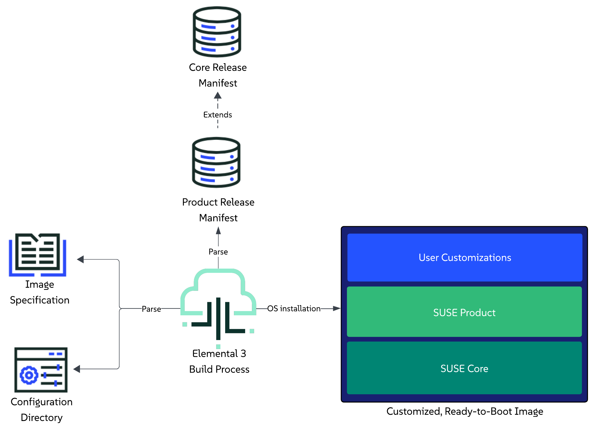

# Image Build and Customization

This section provides an overview of how the `elemental3` command-line interface enables users to build ready to boot images that are customized, extended and based on a specific set of components defined in a [release manifest](release-manifest.md).

## elemental3 build

The `elemental3 build` command is the entry point for the image build and customization process.

As part of the command, users are expected to provide:

1. **Specifications for the image** - these are defined as options to the command itself. Available specification options can be viewed by calling the command's help message: `elemental3 build -h`.
2. **Information about the desired state of the image** - this is done through the definition of a configuration directory that the user creates beforehand. For more information on the directory itself, refer to the [Configuration Directory Guide](configuration-directory.md).

We recommend you familiarize yourself with both points before attempting to build your first image.

### Limitations

Currently, the image build and customization process has the following limitations:

1. Supports building images only for `x86_64` platforms.
2. Supports building only `RAW` type images.
3. Supports building images for connected (non air-gapped) environments only.

Elemental is in active development, and these limitations **will** be addressed as part of the product roadmap.

### Usage

Below you can find the minimum set of options that the command requires:

```shell
sudo elemental3 build --image-type <value> --config-dir <path>
```
Unless configured otherwise, after execution, the process will create a directory called `_build` which will contain the ready to boot image.

> **NOTE:** If you have specified either the `--build-dir` or `--output` options, your build directory and/or image name will be different.

For more information on what the `_build` directory is about, refer to the [Build Directory Overview](#build-directory-overview) section.

For an overview of the workflow that this command goes through, refer to the [Build and Customization Process Overview](#build-and-customization-process-overview) section.

For a real-life example usage for the command, refer to the [Example](#example) section.

### Build Directory Overview

The `elemental3 build` command creates a build directory for each execution. Apart from the image, this build directory holds all the files and sub-directories used for build.

The expanded build directory contains the following files and subdirectories:

```shell
_build/
├── build-<timestamp>
│   ├── config.sh
│   ├── overlays/
│   └── release-manifests/
└── image-<timestamp>.raw
```

*Files:*
* `config.sh` - script responsible for applying configurations to the operating system during installation.
* `image-<timestamp>.raw` - the built image. This file will be present in the build directory only if the `--output` option was not specified.

*Directories:*
* `overlays` - resources under this directory will be directly overlayed onto the booted operating system.
* `release-manifests` - holds any release manifests that were pulled from an OCI image.

## Build and Customization Process Overview

> **NOTE**: The user is able to build Linux-only images by **excluding** Kubernetes resources and deployments from the configuration directory (regardless of whether this is under `kubernetes/manifests`, `kubernetes.yaml` or `release.yaml`). This is currently an implicit process, but it is possible that an explicit option for it (e.g. a flag) is added at a later stage.

This section provides a high-level overview of the steps that Elemental's tooling goes through in order to produce a built, customized and extended image.

*Steps:*
1. Parse the user provided image specifications.
2. Parse the configuration directory that the user has defined in the image specification.
3. Parse the [product release manifest](release-manifest.md#product-release-manifest) that the user has defined as a [release reference](configuration-directory.md#product-release-reference) in the `release.yaml` file of the configuration directory.
4. Pull and parse the [core platform release manifest](release-manifest.md#core-platform-release-manifest) that the aforementioned product manifest extends.
5. Prepare for Kubernetes cluster creation and resource deployment:
   1. Prepare Helm charts and Kubernetes manifests
   2. Download the RKE2 extension image, as specified in the parsed core platform release manifest.
6. Begin the OS installation process:
   1. Create a new disk image with size as defined in `install.yaml` and type as specified by the user.
   2. Attach a loop device to the newly created image.
   3. Partition loop device and start a btrfs snapshotter transaction.
   4. Unpack the base operating system image that was defined in the parsed core platform release manifest.
   5. Merge the base operating system image setup with the configurations and/or extensions provided either by the user, or by a release manifest.
   6. Install the bootloader and setup the kernel parameters, as defined in the `install.yaml` file.
   7. Setup the default snapshot for the operating system.
14. Mark installation and build as completed.



## Example

This section provides an example on how users can leverage the `elemental3` command-line interface to start an image build process and produce a ready to boot image that is customized and extended based on a specific use case.

### Prerequisites

* Access to SUSE's internal VPN (as of this moment, our component images are not publicly available).
* A server or virtual machine running Tumbleweed, Leap 16.0, Leap Micro 6.2, SLES 16 or SUSE Linux Micro 6.2, with a minimum x86_64-v2 instruction set.
* Some other packages can also be needed if you want to compile the binaries yourself: `git-core go make mtools squashfs xorriso`.

#### Workaround for SELinux

SELinux should be set in `permissive` mode to be able to execute the `build*` or `install` commands on the build host. This is a workaround, we are working on fixing this.

The resulting OS image will not be impacted by this workaround. It will have the default SELinux configuration has expected, so in `enforcing` mode if it is set by default.

### Use case

A consumer has created a release manifest for their product that extends a specific `Core Platform` version with additional components, namely `Rancher` and `cert-manager`.

A user wants their environment to be running an operating system, Kubernetes distribution and Rancher version that are supported by the aforementioned consumer product.

In addition, the user wants to extend their environment by deploying the `NeuVector` Helm chart along with a specific set of Kubernetes manifests that will enable access to the Rancher UI.

### Configuration directory setup

The user creates a [configuration directory](../examples/elemental/build/) that describes the desired state of the image that needs to be built.

The contents of this directory include:

* [install.yaml](../examples/elemental/build/install.yaml) - specify which `bootloader` and `kernel command line` arguments to use during the OS installation process and to define the actual `disk size` of the image.
* [butane.yaml](../examples/elemental/build/butane.yaml) - specify an optional [butane](https://coreos.github.io/butane/) configuration yaml to include as part of the firstboot configuration.
* [kubernetes.yaml](../examples/elemental/build/kubernetes.yaml) - specify the Helm charts and Kubernetes manifests that the user wishes to deploy as part of their use case.
* [release.yaml](../examples/elemental/build/release.yaml) - specify the reference to the user desired product and enable the necessary Helm chart components.
* [suse-product-manifest.yaml](../examples/elemental/build/suse-product-manifest.yaml) - the release manifest for the desired product that the user has referred in the `release.yaml` configuration file.
* [rancher.yaml](../examples/elemental/build/kubernetes/helm/values/rancher.yaml) - custom values for the `Rancher` Helm chart that we enabled from the SUSE Product manifest.
* [ip-pool.yaml](../examples/elemental/build/kubernetes/manifests/ip-pool.yaml) - local manifest to apply to the cluster and have the enabled `MetalLB` component setup an `IPAddressPool`.
* [l2-adv.yaml](../examples/elemental/build/kubernetes/manifests/l2-adv.yaml) - local manifest to apply to the cluster and have the enabled `MetalLB` component setup a `L2Advertisement`.
* [rke2-ingress-config.yaml](../examples/elemental/build/kubernetes/manifests/rke2-ingress-config.yaml) - local manifest that will edit the existing `rke2-ingress-nginx` Helm chart and will enable its service to be of type `LoadBalancer`.
* [node1.qemu.yaml](../examples/elemental/build/network/node1.qemu.yaml) - custom network configuration that will be used as part of the [QEMU image boot example](#qemu).
* [node2.libvirt.yaml](../examples/elemental/build/network/node2.libvirt.yaml) - custom network configuration that will be used as part of the [Libvirt image boot example](#libvirt).

### Building the actual image

```shell
cd examples/elemental/build/
sudo elemental3 build --image-type raw --config-dir . --output example.raw
```

After execution, your `examples/elemental/build` directory should look similar to:

```shell
.
├── _build <- created by build command
├── example.raw <- created by build command
├── install.yaml
├── kubernetes/
├── kubernetes.yaml
├── network/
├── butane.yaml
├── release.yaml
└── suse-product-manifest.yaml
```
### Booting the built image

> **NOTE:** The below RAM and vCPU resources are just reference values, feel free to tweak them based on what your environment needs.

#### Libvirt

```shell
virt-install --name uc-demo \
             --ram 16000 \
             --vcpus 8 \
             --disk path="example.raw",format=raw \
             --osinfo detect=on,name=sle-unknown \
             --graphics none \
             --console pty,target_type=serial \
             --network network=default,model=virtio,mac=FE:C4:05:42:8B:AB \
             --virt-type kvm \
             --import \
             --boot uefi,loader=/usr/share/qemu/ovmf-x86_64-ms-code.bin,nvram.template=/usr/share/qemu/ovmf-x86_64-ms-vars.bin
```

> **NOTE:** Based on the `FE:C4:05:42:8B:AB` MAC address, during first boot this will machine apply the network configuration defined in the [node2.libvirt.yaml](../examples/elemental/build/network/node2.libvirt.yaml) file.

#### QEMU

```shell
qemu-kvm -m 16000 \
         -smp 8 \
         -bios /usr/share/qemu/ovmf-x86_64.bin \
         -cpu host \
         -nographic \
         -netdev user,id=net0,net=192.168.122.0/24,hostfwd=tcp::16443-:6443 \
         -device virtio-net-pci,netdev=net0,mac=FE:C4:05:42:8B:AA \
         -hda "example.raw"
```

> **NOTE:** Based on the `FE:C4:05:42:8B:AA` MAC address, during first boot this will machine apply the network configuration defined in the [node1.qemu.yaml](../examples/elemental/build/network/node1.qemu.yaml) file.

### Environment overview

After booting the image and logging into it using the user specified under the `butane.yaml` configuration file, let's view what the end environment looks like.

1. Verify that the expected operating system is running:

   ```shell
   cat /etc/os-release
   ```

1. Verify the custom network configuration service:

   ```shell
   journalctl -u first-boot-network.service
   ```

1. Verify the machine's hostname:

   > **NOTE:** If you have defined a MAC address that matches one of the network configuration files defined under the [network/](../examples/elemental/build/network/) directory, the hostname will be set to the name of that file.

   ```shell
   cat /etc/hostname
   ```

1. Verify that the RKE2 distribution is running:

   ```shell
   systemctl status rke2-server.service
   ```

1. Setup `kubectl`:

   ```shell
   alias kubectl='KUBECONFIG=/etc/rancher/rke2/rke2.yaml /var/lib/rancher/rke2/bin/kubectl'
   ```

1. Verify cluster node:

   ```shell
   kubectl get nodes -o wide
   ```

1. Verify that the Core Platform enabled `MetalLB` component is running:

   ```shell
   kubectl get pods -n metallb-system

   # Example output
   NAME                                  READY   STATUS    RESTARTS   AGE
   metallb-controller-6b59fb78f4-fk6wq   1/1     Running   0          13m
   metallb-speaker-w9gtc                 4/4     Running   0          13m
   ```

1. Verify product enabled Helm chart components:

   * *NeuVector*:

      ```shell
      kubectl get pods -n neuvector-system

      # Example output
      NAME                                        READY   STATUS      RESTARTS   AGE
      neuvector-cert-upgrader-job-ntj2d           0/1     Completed   0          9m4s
      neuvector-controller-pod-79bb56d6c4-dmxmx   1/1     Running     0          11m
      neuvector-controller-pod-79bb56d6c4-lq2p8   1/1     Running     0          11m
      neuvector-controller-pod-79bb56d6c4-xjrk2   1/1     Running     0          11m
      neuvector-enforcer-pod-wmlqx                1/1     Running     0          11m
      neuvector-manager-pod-987b84867-4k88j       1/1     Running     0          11m
      neuvector-scanner-pod-d8bf5677d-6k6tf       1/1     Running     0          11m
      neuvector-scanner-pod-d8bf5677d-hnxfk       1/1     Running     0          11m
      neuvector-scanner-pod-d8bf5677d-s67zh       1/1     Running     0          11m
      ```
   * *Rancher*:

      ```shell
      kubectl get pods -n cattle-system

      # Example output
      NAME                                        READY   STATUS      RESTARTS   AGE
      rancher-66b9664747-j2sfp                    1/1     Running     0          36m
      rancher-webhook-7748c7b4bf-42xg4            1/1     Running     0          22m
      system-upgrade-controller-67f899b56-rzcqh   1/1     Running     0          21m
      ```

1. Verify that the custom `Rancher` Helm chart values defined under `kubernetes/helm/values/rancher.yaml` have been propagated to the `rancher` HelmChart resource:

   ```shell
   kubectl get helmchart rancher -n kube-system -o jsonpath='{.spec.valuesContent}'

   # Example output
   bootstrapPassword: admin1234
   hostname: 192.168.76.15.sslip.io
   replicas: 1
   ```

1. Verify that the manifests from the `kubernetes/manifests` directory have been applied:

   * MetalLB `IPAddressPool` resource:

      ```shell
      kubectl get ipaddresspools -A

      # Example output
      NAMESPACE        NAME             AUTO ASSIGN   AVOID BUGGY IPS   ADDRESSES
      metallb-system   ingress-ippool   true          false             ["192.168.76.15/32"]
      ```

   * MetalLB `L2Advertisement` resource:

      ```shell
      kubectl get l2advertisements -A

      # Example output
      NAMESPACE        NAME             IPADDRESSPOOLS       IPADDRESSPOOL SELECTORS   INTERFACES
      metallb-system   ingress-l2-adv   ["ingress-ippool"]
      ```

   * RKE2 NGINX Ingress controller service is available, of type `LoadBalancer` and running on the `192.168.76.15` IP:

      ```shell
      kubectl get svc rke2-ingress-nginx-controller -n kube-system

      # Example output
      NAME                            TYPE           CLUSTER-IP     EXTERNAL-IP     PORT(S)                      AGE
      rke2-ingress-nginx-controller   LoadBalancer   10.43.117.57   192.168.76.15   80:30594/TCP,443:32133/TCP   42m
      ```

Verifying this confirms that the booted environment matches the desired state.
